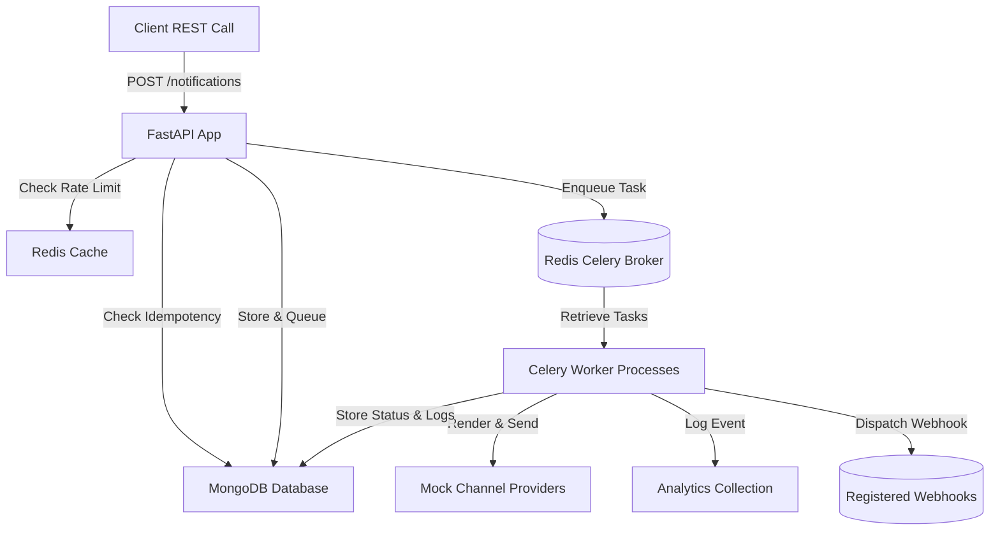

# Design Document: Notification Service

This document describes the architectural patterns, database schemas, processing flows, scaling strategies, and design trade-offs of the Notification Service.

## 1. System Architecture

The Notification Service is built on top of a highly decoupled, asynchronous, worker-based design. The diagram below illustrates the path of a notification request from client submission to delivery:



## 2. Sequence Diagram

This sequence diagram outlines the interaction during a successful notification delivery lifecycle:

```mermaid
sequence_code
sequenceDiagram
    autonumber
    actor Client
    participant API as FastAPI App
    participant Redis as Redis Cache
    participant DB as MongoDB (Beanie)
    participant Queue as Redis Queue (Celery Broker)
    participant Worker as Celery Worker
    participant Provider as Channel Provider

    Client->>API: POST /notifications (Idempotency-Key)
    API->>Redis: Check Rate Limit (zset log)
    Redis-->>API: Rate Limit OK
    API->>DB: Check Idempotency Key
    DB-->>API: Key Not Found
    API->>DB: Validate User & Template Existence
    DB-->>API: Validated
    API->>DB: Persist Notification (Status: Queued)
    API->>Queue: Enqueue Task (Routed by Priority)
    API-->>Client: 201 Created (Notification Details)
    
    Queue->>Worker: Consume Task
    Worker->>DB: Update Status (Processing)
    Worker->>Provider: send() via Email/SMS/Push
    Provider-->>Worker: Success (Message ID)
    Worker->>DB: Update Status (Delivered) & Append Log
    Worker->>DB: Record Analytics Event
    Worker->>Client: Dispatch Webhook (Delivery Status)
```

## 3. Database Design

We use MongoDB for flexible document models, indexed for high-volume searches.

### Collections

#### 1. Users (`users` collection)
Holds user contact registry.
- `_id`: `ObjectId` (Primary Key)
- `name`: `String`
- `email`: `String` (Indexed)
- `phone`: `String`
- `created_at`: `ISODateTime`

#### 2. UserPreferences (`user_preferences` collection)
Controls individual channel notifications.
- `_id`: `ObjectId`
- `user_id`: `ObjectId` (Unique, Indexed)
- `email_enabled`: `Boolean`
- `sms_enabled`: `Boolean`
- `push_enabled`: `Boolean`
- `updated_at`: `ISODateTime`

#### 3. Templates (`templates` collection)
Stores pre-defined notification templates.
- `_id`: `ObjectId`
- `name`: `String` (Unique, Indexed)
- `subject`: `String` (Optional, for emails)
- `body`: `String`
- `created_at`: `ISODateTime`

#### 4. Notifications (`notifications` collection)
Logs details and trace histories for each dispatch request.
- `_id`: `ObjectId` (Primary Key)
- `user_id`: `ObjectId` (Indexed)
- `channels`: `Array[String]`
- `priority`: `String` (Indexed - Critical, High, Normal, Low)
- `template_name`: `String`
- `variables`: `Object`
- `rendered_message`: `Object` (channel mapped strings)
- `status`: `String` (Indexed - Pending, Queued, Processing, Sent, Delivered, Failed, Retrying, Skipped)
- `retry_count`: `Integer`
- `idempotency_key`: `String` (Unique Sparse Indexed)
- `delivery_logs`: `Array[Object]` (logs for each sending attempt)
- `webhook_url`: `String` (Optional callback hook)
- `created_at`: `ISODateTime` (Indexed)
- `updated_at`: `ISODateTime`

#### 5. Analytics (`analytics` collection)
Tracks metrics on channels.
- `_id`: `ObjectId`
- `channel`: `String` (Indexed)
- `status`: `String` (Indexed)
- `timestamp`: `ISODateTime` (Indexed)

---

## 4. Queue Architecture & Priority Flow

- **Celery Priority Routing:**
  Internal priority values map directly to dedicated Celery queues:
  - `Critical` -> `critical` queue
  - `High` -> `high` queue
  - `Normal` -> `normal` queue
  - `Low` -> `low` queue
- **Worker Configuration:**
  Workers run with `-Q critical,high,normal,low`. Because Celery consumes from left to right, messages waiting on the `critical` queue are always dequeued first, followed by `high`, then `normal`, and finally `low`.
- **Deduplication upon Retry:**
  When tasks are retried, we inspect `delivery_logs` to check which channels were already successfully sent. We only execute sending for failed channels.

---

## 5. Retry Flow & Circuit Breaker

### Exponential Backoff
If a channel provider fails or the circuit is tripped, the task is retried:
$$\text{Countdown} = 2^{\text{retries}} \text{ seconds}$$
- Attempt 1: 1s countdown.
- Attempt 2: 2s countdown.
- Attempt 3: 4s countdown.
If all 3 retries fail, status updates to `Failed`.

### Shared Redis Circuit Breaker
Every provider call is wrapped in a stateful `RedisCircuitBreaker` to protect third-party gateways during downtime:
- **CLOSED:** Standard behavior. Consecutive failures are tracked.
- **OPEN:** Tripped after 3 consecutive failures. Rejects requests immediately for 30s.
- **HALF-OPEN:** Triggered after 30s. Attempts a single request. A success resets the state to CLOSED; a failure trips it back to OPEN immediately.

---

## 6. Scaling Strategy

- **Horizontal Scalability:**
  FastAPI containers are stateless and can be scaled behind a standard load balancer. Celery workers can be scaled horizontally across instances depending on the queue size (e.g. adding more workers to the `critical` queue during peak traffic).
- **Database Partitioning:**
  MongoDB collections (especially `notifications` and `analytics`) can be sharded on `user_id` or `created_at` to support terabyte-scale log logs.
- **Redis Clustering:**
  Redis can be deployed in a cluster to handle high-frequency rate-limiting checks and Celery task broker dispatches.

---

## 7. Trade-offs

1. **MongoDB vs SQL:**
   MongoDB was chosen to allow structured JSON dispatches and flexible log fields. We sacrifice strict relational foreign keys, but gain query flexibility and write speeds.
2. **In-Memory MOCK_MODE vs Real Databases:**
   The implementation supports a robust `MOCK_MODE` allowing the entire stack to run in-memory for testing, local evaluation, and developer environments. In production, this toggle is disabled to use persistent MongoDB and Redis instances.
3. **Fail-Open Rate Limiting:**
   If Redis goes down, our rate limiter catches the error and fails-open (notifications still go through). This prioritizes user availability over strict rate enforcement.
